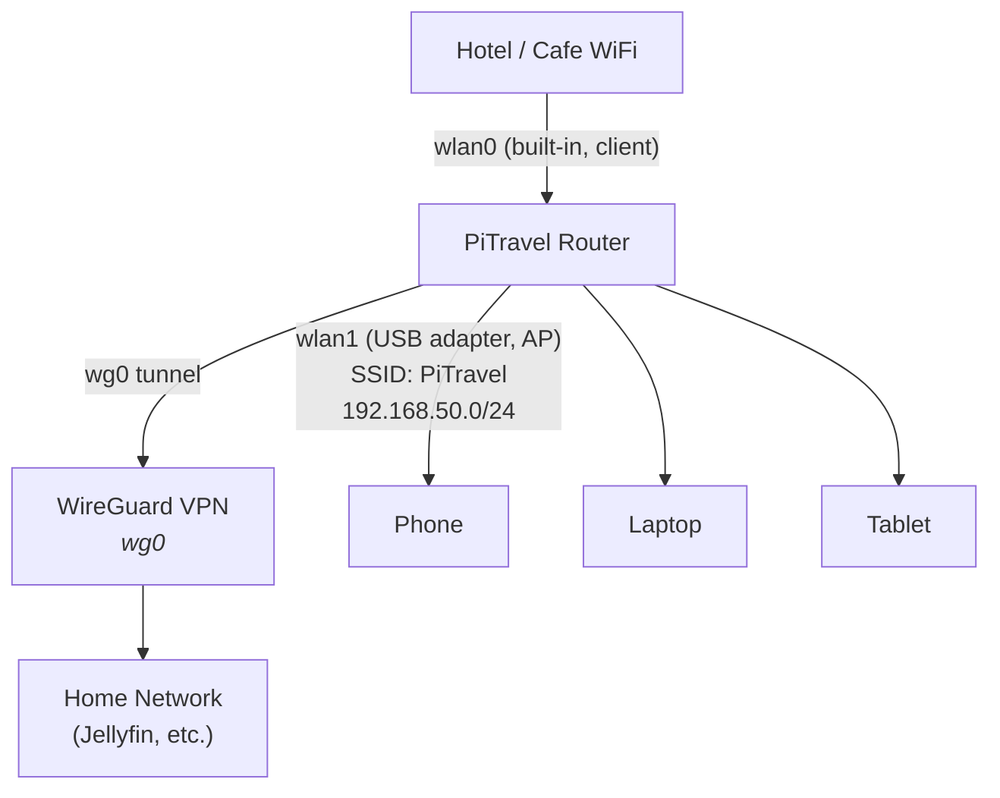
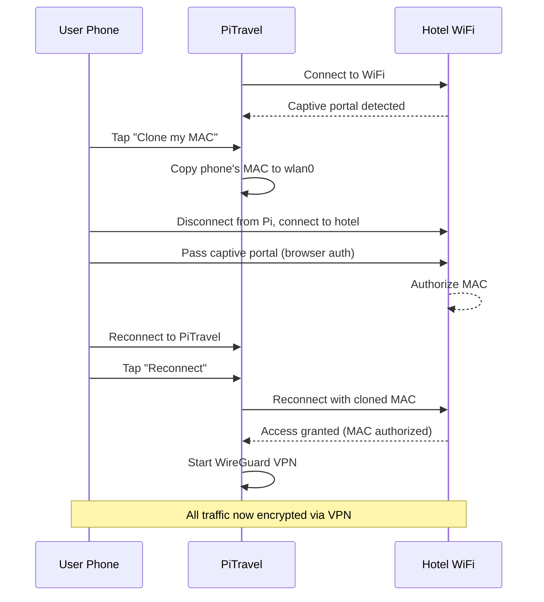
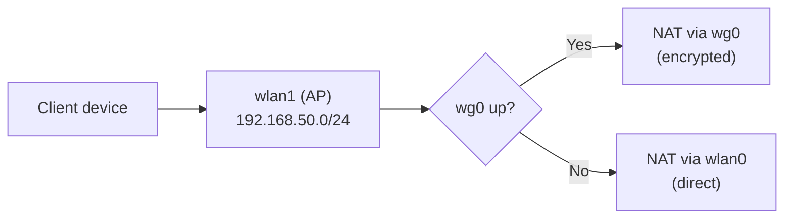

# PiTravel Router

Raspberry Pi travel router with WiFi management, captive portal bypass, WireGuard VPN, media server, and Jellyfin sync.

## What it does

Turns a Raspberry Pi into a portable travel router. Connect to hotel/cafe WiFi, share it as a private access point, route traffic through your home VPN, and carry your media library offline.



## Features

- **WiFi Manager**: scan, connect, and switch networks from a mobile-first web UI
- **Captive Portal Bypass**: detects portals and offers MAC cloning to pass through them
- **WireGuard VPN**: routes all traffic through your home VPN when available
- **Media Server**: nginx serves video files (mp4, mkv, avi) for Infuse/VLC at port 8080
- **Jellyfin Sync**: pulls favorites from your home Jellyfin server over VPN
- **PiSugar Battery**: optional battery monitoring (PiSugar HAT)

## Captive Portal Bypass Flow

Most hotel WiFis require web authentication (captive portal). The Pi can't open a browser, so PiTravel uses MAC cloning:



## Hardware

| Component | Required | Notes |
|---|---|---|
| Raspberry Pi 3B+/4/5 | Yes | Any model with built-in WiFi |
| USB WiFi adapter | Yes | For the access point (needs AP mode support, e.g. RT5370) |
| USB drive / SSD | Yes | For media storage |
| PiSugar HAT | No | Battery monitoring |
| MicroSD card | Yes | 8GB+ with Raspberry Pi OS Lite |

## Installation

```bash
# Flash Raspberry Pi OS Lite to SD card, boot, SSH in, then:
curl -sLO https://raw.githubusercontent.com/alejandroSuch/travelpi/main/travelpi.sh && sudo bash travelpi.sh
```

The installer prompts for:
- AP SSID and password
- PiSugar support (y/n)
- Jellyfin sync (y/n), and if yes: API key, user ID, server URL
- WireGuard peer config (public key + endpoint)

## Web UI

Mobile-first dark interface served at `http://192.168.50.1` (port 80).

### Home screen

Shows battery level, connected devices, VPN status, storage usage. Links to WiFi manager, media server, and Jellyfin sync.

```
┌──────────────────────────┐
│       ┌──────┐           │
│       │ Logo │           │
│       └──────┘           │
│      PiTravel            │
│                          │
│  ┌──────┬──────┬──────┐  │
│  │ 78%  │  3   │  On  │  │
│  │ Batt │ Devs │ VPN  │  │
│  └──────┴──────┴──────┘  │
│                          │
│  ┌────────────────────┐  │
│  │ WiFi      Hotel ▸  │  │
│  ├────────────────────┤  │
│  │ Media    12 films ▸│  │
│  ├────────────────────┤  │
│  │ Sync     Jellyfin ▸│  │
│  └────────────────────┘  │
│                          │
│  Storage  12.4 / 64 GB   │
│  ████████░░░░░░░░░ 19%   │
└──────────────────────────┘
```

### WiFi screen

Lists available networks with signal strength. Shows captive portal alert with MAC clone button when detected.

```
┌──────────────────────────┐
│  ← Conectar WiFi         │
│                          │
│  ┌────────────────────┐  │
│  │ ⚠ Portal detectado │  │
│  │ [Clonar mi MAC]    │  │
│  └────────────────────┘  │
│                          │
│  Redes       [Escanear]  │
│                          │
│  ┌────────────────────┐  │
│  │ ● Hotel_WiFi  -45  │  │
│  │   Cafe_Guest  -62  │  │
│  │   Airport     -78  │  │
│  └────────────────────┘  │
│                          │
│  ┌────────────────────┐  │
│  │ Conectar a Hotel   │  │
│  │ [___contraseña___] │  │
│  │ [Cancel] [Connect] │  │
│  └────────────────────┘  │
└──────────────────────────┘
```

## Architecture

```
/opt/pitravel/
├── app.py              # Flask web app (WiFi manager, status API, sync trigger)
├── sync.py             # Jellyfin favorites downloader
├── sync_cron.sh        # Cron wrapper (checks VPN before sync)
└── templates/
    ├── home.html       # Dashboard
    └── wifi.html       # WiFi manager

System services:
├── pitravel.service    # Flask app on port 80
├── hostapd             # Access point on USB WiFi adapter
├── dnsmasq             # DHCP for AP clients (192.168.50.10-100)
├── wg-quick@wg0        # WireGuard VPN
└── nginx               # Media server on port 8080
```

## API

| Endpoint | Method | Description |
|---|---|---|
| `/api/status` | GET | Battery, VPN, devices, storage, media stats |
| `/api/wifi/scan` | GET | Available networks with signal strength |
| `/api/wifi/connect` | POST | Connect to a network `{ssid, password}` |
| `/api/wifi/clone` | POST | Clone requesting client's MAC to wlan0 |
| `/api/wifi/reconnect` | POST | Reconnect + restart VPN |
| `/api/sync` | POST | Trigger Jellyfin sync (requires VPN) |

## Traffic routing



## License

MIT
